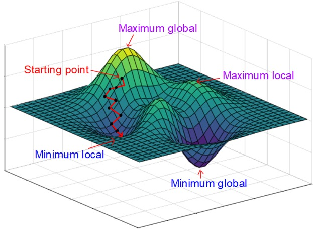

### Gradient descent method

One of the simplest first-order optimization techniques is the **gradient descent method** [(Hao, 2020)](https://www.sciencedirect.com/science/article/pii/S0893965920303712). This approach relies on the gradient $\nabla f(\mathbf{v})$ of the objective function with respect to the parameters, which determines the direction in which each parameter should be updated.

Given a step size $\alpha$, at each iteration $n$ of the gradient descent process, the parameter vector is progressively adjusted in the direction opposite to the gradient evaluated at the current parameter values $(n = 0, 1, 2, \ldots)$:
  
$$
  \mathbf{v}_{n+1} = \mathbf{v}_{n} + \alpha \nabla\f\left(\mathbf{v}_{n}\right), \ \forall n \in \mathbb{N}_0.
$$
  
where $\mathbf{v}_0$ denotes the initial parameter vector. The scalar $\alpha$ represents the learning rate, a positive constant that controls the magnitude of each update step.

As is well known, this procedure aims to adjust the parameter in the direction of the greatest rate of change of the objective function, a behavior that is commonly illustrated through geometric representations (see Figure 1).

**Figure 1.** Illustration of the gradient descent method

    

Despite its simplicity, this method may sometimes lead to updates in undesirable directions, corresponding to parameter values that become fixed within the model (for example, parameters constrained to zero).

#### **Citation**

To cite this Streamlit application in your academic work, teaching, or research:

#### APA style

Llinás Marimón, H., & Llinás Solano, H. (2026). Interactive gradient descent in two (2D) and three (3D) dimensions [Streamlit application]. Streamlit.
https://gradientdescent-jkz8f8lzb49vc9efxjye5h.streamlit.app/

#### BibTeX

@misc{llinas2026gradientdescent,  
    author       = {Humberto Llinás Marimón and Humberto Llinás Solano},  
    title        = {Interactive Gradient Descent in Two (2D) and Three (3D) Dimensions},  
    year         = {2025},  
    howpublished = {\url{https://gradientdescent-jkz8f8lzb49vc9efxjye5h.streamlit.app/}},  
    note         = {Streamlit application}  
}